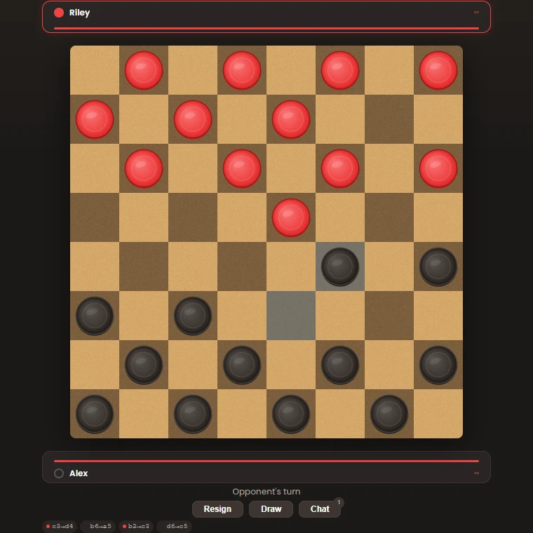

# Pure Checkers

Free online checkers in the browser. No ads, no energy bars, no real-money purchases, no account needed.

**Play now: [purecheckers.com](https://purecheckers.com)**



Local build, 11 September 2026: Alex and Riley are demonstration guest profiles. This screenshot is not a production deployment record.

Pure Checkers exists because every checkers app I found had ads, or an energy bar that stopped me after two games unless I paid to refill it. The game stays free, including playing against bots.

## What it does

- Play strangers through quick play, a friend by handing them your phone to scan or by sending a link, or one of three server-side bots (Easy, Medium, Hard; budgeted minimax up to depth 2, 4 and 6 in background workers) with their own emote personalities.
- 8x8 checkers with compulsory captures and multi-jumps. Men capture in all four directions and kings move any distance along a diagonal (pool-style rules); the [rules page](https://purecheckers.com/strategy/checkers-rules) explains where that differs from English draughts.
- Private rooms by code or scan, spectating, replays of every finished game, ELO for registered players, and a closed coin economy for cosmetics with no real money.
- Live gameplay uses server commands and authoritative snapshots, with accepted moves checkpointed in PostgreSQL. Unfinished games restore with an explicit readiness pause; waiting rooms and active-game spectator roles restore from durable records. Recorded notices and dismissal also survive restart. Finished-result membership, original expiry deadlines and rematch consent also persist; production replacement acceptance remains pending. See [result recovery](docs/result-lifecycle.md), [game recovery](docs/game-restoration.md) and [room recovery and rollout limits](docs/durable-rooms.md).

## Stack

SvelteKit 2 / Svelte 5 client, Express 5 + socket.io server on adapter-node, Prisma + PostgreSQL. One Node container on Railway.

## Running it locally

Install Node.js 22 or 24 LTS and Docker with Compose. The database uses port 5432; development uses ports 3001 and 5173.

```
npm ci
npm run db:up            # PostgreSQL 16 in Docker (docker-compose.yml)
cp .env.example .env     # then set JWT_SECRET
npm run db:migrate       # applies prisma/migrations
npm run db:seed          # bots and shop items
npm run dev              # Express on :3001 and Vite on :5173
```

Open `http://localhost:5173`. The example environment uses local invitation URLs and leaves `NODE_ENV` unset; development needs no production build. If ports are occupied, change `PORT`, `CLIENT_PORT` and `SITE_URL` together; the proxy follows `PORT` and Vite fails instead of silently choosing a different client port. Do not use a production database for local testing.

For a phone on the same network, set `SITE_URL` to this computer's LAN address with the client port. Run `npm run dev:server` in one terminal and `npm run dev:client -- --host 0.0.0.0` in another, and allow the client port through the local firewall for that trusted network.

To test the production build locally, set `SITE_URL` and `ORIGIN` in `.env` to `http://localhost:3001`, then run `npm run build` and `npm start`. Open port 3001 for this mode. Startup applies pending migrations and seeds bots/shop items idempotently before serving the build; it works on Windows and Unix.

Tests use a separate database (`checkers_test` by default, `TEST_DATABASE_URL` to override):

```
docker compose exec postgres createdb -U postgres checkers_test # once, if absent
npm test
```

For a custom `TEST_DATABASE_URL`, create that database first. Tests apply migrations to it but do not create the database. `npm ci` explicitly generates Prisma Client; do not omit development dependencies when installing this source project, since its build and migration tools are required.

Deployment notes, including why persistence is PostgreSQL only, are in [docs/deployment.md](docs/deployment.md). Design notes for the gameplay session model, navigation and animations are in [docs/](docs/).

## Feedback

The public changelog is at [purecheckers.com/changelog](https://purecheckers.com/changelog). Report problems through [GitHub Issues](https://github.com/prykris/purecheckers/issues/new); a GitHub account is required. Include reproduction steps, browser/device and a replay link when available. Reports are public: do not include passwords or private account information.

## Repository policy

Pure Checkers is not offered under an open-source licence. Repository visibility does not change that policy. No open-source licence is granted by this README.
